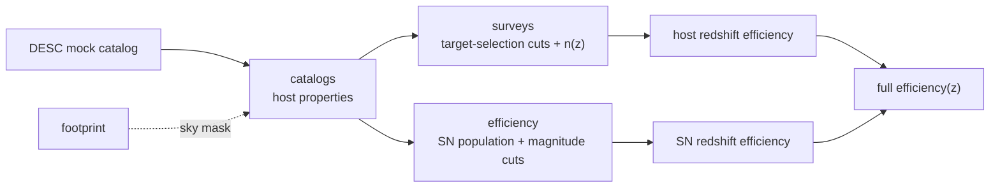

# desidescsn

**desidescsn** forecasts how efficiently spectroscopic surveys recover the
**host-galaxy redshifts of type-Ia supernovae** — the key ingredient for
combining **DESI** (and DESI2 / 4MOST) spectroscopy with **DESC / LSST**
supernova samples.

Starting from a DESC mock galaxy catalog, it lets you:

- **extract** host-galaxy properties (photometry, redshift, stellar mass, SFR)
  from a DESC DC2 / Roman-Rubin catalog ([`catalogs`](api/catalogs.md));
- **apply** each survey's target-selection cuts and encode its host efficiency
  and observed `n(z)` ([`surveys`](api/surveys.md)) — DESI BGS/LRG, DESI2,
  4MOST CRS BG/LRG and 4HS;
- **model** the SN population (rate, host-weight models) and compute the
  **host** and **SN** redshift efficiencies, combined into a full survey
  efficiency ([`efficiency`](api/efficiency.md));
- **mask** samples by survey sky footprint ([`footprint`](api/footprint.md)).

## The idea in one picture



## Quick look

```python
import numpy as np
from desidescsn import efficiency

# a parametric redshift distribution
z = np.linspace(0.01, 1.5, 100)
n_z = efficiency.n_z_function(z, A=1.0, z0=0.3, beta=2.0, d=2.0)
```

## Next steps

- [Getting started](getting-started.md) — install and run the pieces.
- [How it works](pipeline.md) — the efficiency forecast end to end.
- [API reference](api/index.md) — every module and function.

!!! note "Scope"
    This is a research forecasting package. Several inputs (DESC catalogs, DESI
    Y1 data, survey-strategy files) are large or access-restricted; the
    functions that need them are documented but read data you supply.
