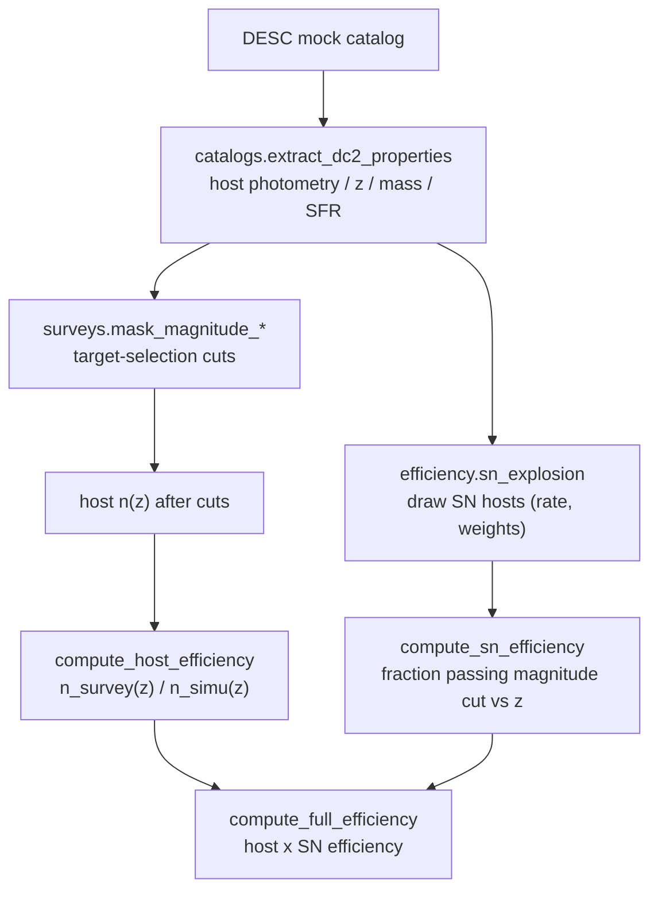

# How it works

desidescsn forecasts the **redshift efficiency** with which a spectroscopic
survey recovers the host redshifts of type-Ia supernovae, by combining a **host**
efficiency and a **SN** efficiency computed on a simulated galaxy sample.

## Host redshift efficiency

The **host efficiency** is how a survey's target-selection cuts reshape the
simulated host redshift distribution towards the survey's observed `n(z)`:

1. **Model** the redshift distribution with a parametric Smail-type function
   `n_z_function(z, A, z0, beta, d)` and fit it (`fit_n_z`).
2. **Ratio** the fitted survey and simulation distributions
   (`compute_host_efficiency` -> a callable `efficiency(z)`), optionally capped.
3. **Per survey**, `compute_host_efficiency_survey` either returns the constant
   `host_efficiency_*_simple` product, or builds the data-driven ratio using the
   survey `n(z)` from `get_n_z_survey`.

## SN redshift efficiency

The **SN efficiency** is the fraction of simulated SN hosts that pass a survey's
magnitude/colour cut, as a function of redshift:

1. **Draw** which galaxies host an observable SN over the survey window
   (`sn_explosion`), weighting hosts by a SN model (`return_weight_model`:
   `noweigths`, `snia`, `snia_pec`, `sncc`).
2. **Cut** the SN hosts with the survey selection (`surveys.mask_magnitude_*`).
3. **Bin** the recovered fraction vs redshift (`compute_sn_efficiency`).

## Full efficiency

`compute_full_efficiency` ties both together for a survey: it applies the survey
mask to the SN-host and full samples, computes the SN efficiency, multiplies it
by the host redshift efficiency, and returns the normalised efficiency vs
redshift.

## Surveys covered ([`surveys`](api/surveys.md))

DESI **BGS** and **LRG**, **DESI2**, 4MOST **CRS** (BG and LRG) and **4HS** —
each with approximate magnitude / colour selection cuts, a constant
fibre-assignment x redshift-success efficiency, and one or more `n(z)` loaders
(public target-selection predictions or private DESI Y1 catalogs).

## Sky footprints ([`footprint`](api/footprint.md))

Boolean sky masks for the survey footprints (DESI via `desimodel` tiles, DESI
extended / DESI2 / 4MOST CRS via degraded HEALPix maps, 4HS from a
declination + galactic-latitude cut), plus a helper to lay out an empty HEALPix
map. Coordinates are RA/Dec in degrees; HEALPix maps use the NESTED scheme.
